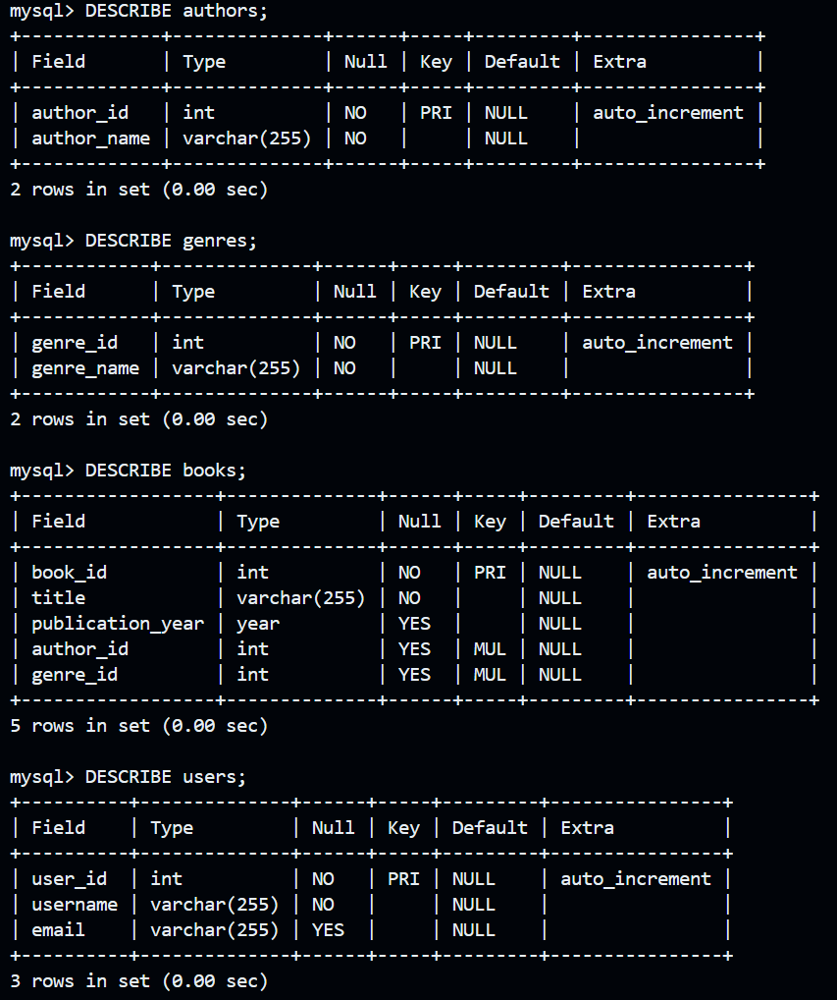
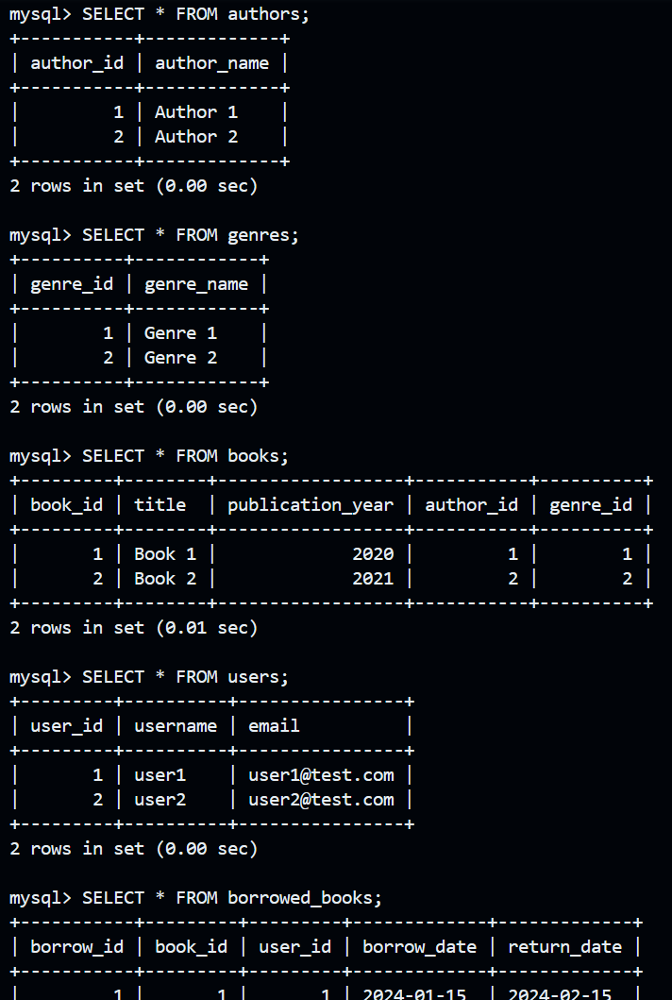
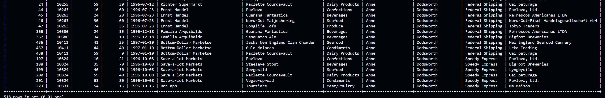
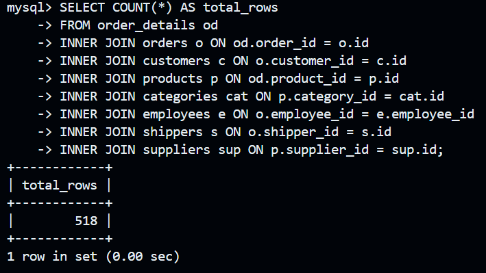
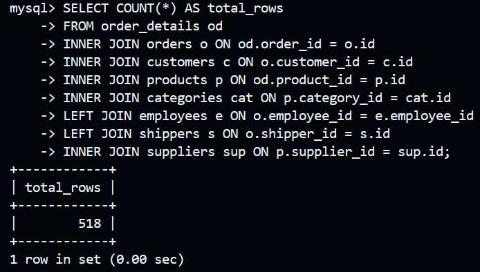
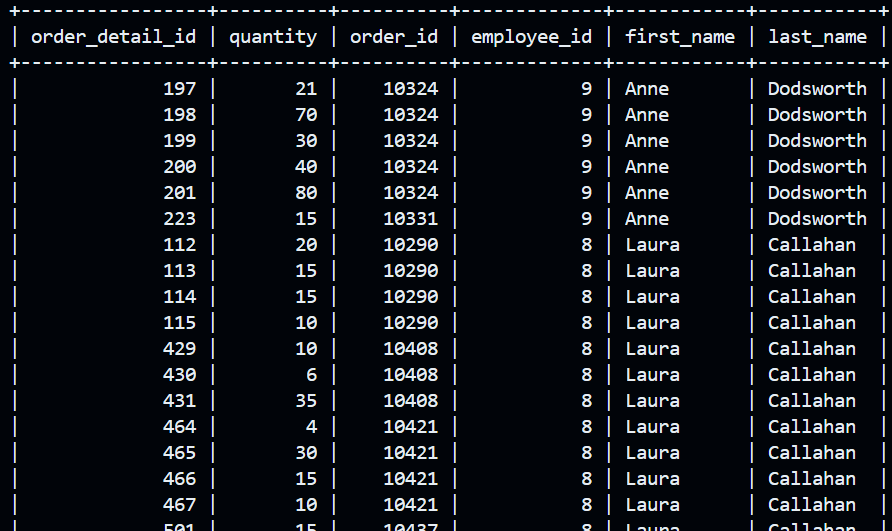
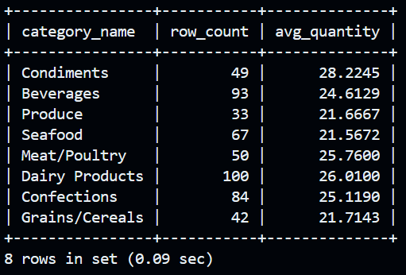
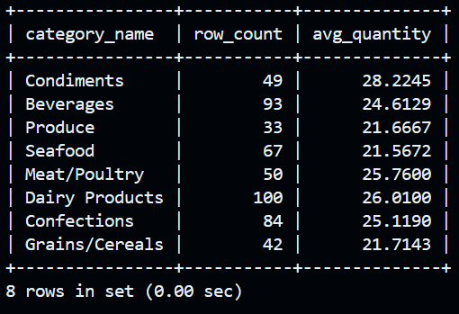
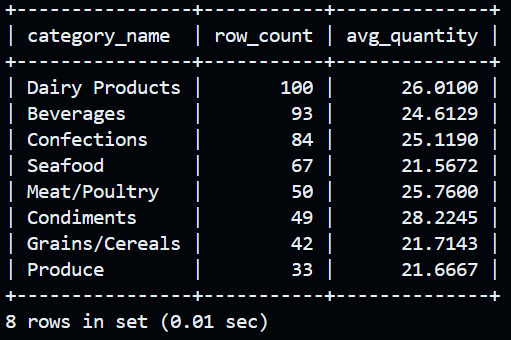
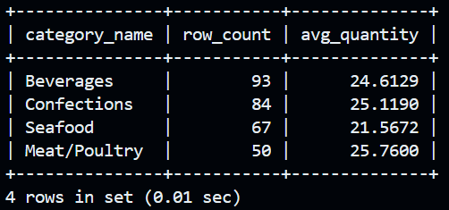

# goit-rdb-hw-04

```bash
sudo apt update && sudo apt install -y mysql-server
```
```bash
sudo service mysql start
```
---

## 1

### Створення схеми та таблиць

```sql
-- Створення схеми
CREATE DATABASE IF NOT EXISTS LibraryManagement;
USE LibraryManagement;

-- Таблиця authors
CREATE TABLE authors (
    author_id INT AUTO_INCREMENT PRIMARY KEY,
    author_name VARCHAR(255) NOT NULL
);

-- Таблиця genres
CREATE TABLE genres (
    genre_id INT AUTO_INCREMENT PRIMARY KEY,
    genre_name VARCHAR(255) NOT NULL
);

-- Таблиця books
CREATE TABLE books (
    book_id INT AUTO_INCREMENT PRIMARY KEY,
    title VARCHAR(255) NOT NULL,
    publication_year YEAR,
    author_id INT,
    genre_id INT,
    FOREIGN KEY (author_id) REFERENCES authors(author_id),
    FOREIGN KEY (genre_id) REFERENCES genres(genre_id)
);

-- Таблиця users
CREATE TABLE users (
    user_id INT AUTO_INCREMENT PRIMARY KEY,
    username VARCHAR(255) NOT NULL,
    email VARCHAR(255)
);

-- Таблиця borrowed_books
CREATE TABLE borrowed_books (
    borrow_id INT AUTO_INCREMENT PRIMARY KEY,
    book_id INT,
    user_id INT,
    borrow_date DATE,
    return_date DATE,
    FOREIGN KEY (book_id) REFERENCES books(book_id),
    FOREIGN KEY (user_id) REFERENCES users(user_id)
);
```



---

## 2

```sql
USE LibraryManagement;

-- Додаємо авторів
INSERT INTO authors (author_name) VALUES 
    ('Author 1'),
    ('Author 2');

-- Додаємо жанри
INSERT INTO genres (genre_name) VALUES 
    ('Genre 1'),
    ('Genre 2');

-- Додаємо книги
INSERT INTO books (title, publication_year, author_id, genre_id) VALUES 
    ('Book 1', 2020, 1, 1),
    ('Book 2', 2021, 2, 2);

-- Додаємо користувачів
INSERT INTO users (username, email) VALUES 
    ('user1', 'user1@test.com'),
    ('user2', 'user2@test.com');

-- Додаємо записи про позичені книги
INSERT INTO borrowed_books (book_id, user_id, borrow_date, return_date) VALUES 
    (1, 1, '2024-01-15', '2024-02-15'),
    (2, 2, '2024-01-20', NULL);
```



---

## 3

```sql
SELECT 
    od.id AS order_detail_id,
    od.order_id,
    od.product_id,
    od.quantity,
    o.date AS order_date,
    c.name AS customer_name,
    p.name AS product_name,
    cat.name AS category_name,
    e.first_name AS employee_first_name,
    e.last_name AS employee_last_name,
    s.name AS shipper_name,
    sup.name AS supplier_name
FROM order_details od
INNER JOIN orders o ON od.order_id = o.id
INNER JOIN customers c ON o.customer_id = c.id
INNER JOIN products p ON od.product_id = p.id
INNER JOIN categories cat ON p.category_id = cat.id
INNER JOIN employees e ON o.employee_id = e.employee_id
INNER JOIN shippers s ON o.shipper_id = s.id
INNER JOIN suppliers sup ON p.supplier_id = sup.id;
```



---

## 4

### 4.1

```sql
SELECT COUNT(*) AS total_rows
FROM order_details od
INNER JOIN orders o ON od.order_id = o.id
INNER JOIN customers c ON o.customer_id = c.id
INNER JOIN products p ON od.product_id = p.id
INNER JOIN categories cat ON p.category_id = cat.id
INNER JOIN employees e ON o.employee_id = e.employee_id
INNER JOIN shippers s ON o.shipper_id = s.id
INNER JOIN suppliers sup ON p.supplier_id = sup.id;
```



---

### 4.2

```sql
-- LEFT JOIN на employees та shippers
SELECT COUNT(*) AS total_rows
FROM order_details od
INNER JOIN orders o ON od.order_id = o.id
INNER JOIN customers c ON o.customer_id = c.id
INNER JOIN products p ON od.product_id = p.id
INNER JOIN categories cat ON p.category_id = cat.id
LEFT JOIN employees e ON o.employee_id = e.employee_id
LEFT JOIN shippers s ON o.shipper_id = s.id
INNER JOIN suppliers sup ON p.supplier_id = sup.id;
```



Я так розумію, що тут планувалось, що кількість може змінитисяб але, якщо в даних є повна відповідність між таблицями, кількість рядків не зміниться. Якщо є записи без відповідності — LEFT/RIGHT JOIN покажуть більше рядків.

---

### 4.3 Фільтр employee_id > 3 та <= 10 (5 балів)

```sql
SELECT 
    od.id AS order_detail_id,
    od.quantity,
    o.id AS order_id,
    e.employee_id,
    e.first_name,
    e.last_name
FROM order_details od
INNER JOIN orders o ON od.order_id = o.id
INNER JOIN customers c ON o.customer_id = c.id
INNER JOIN products p ON od.product_id = p.id
INNER JOIN categories cat ON p.category_id = cat.id
INNER JOIN employees e ON o.employee_id = e.employee_id
INNER JOIN shippers s ON o.shipper_id = s.id
INNER JOIN suppliers sup ON p.supplier_id = sup.id
WHERE e.employee_id > 3 AND e.employee_id <= 10;
```



---

### 4.4

```sql
SELECT 
    cat.name AS category_name,
    COUNT(*) AS row_count,
    AVG(od.quantity) AS avg_quantity
FROM order_details od
INNER JOIN orders o ON od.order_id = o.id
INNER JOIN customers c ON o.customer_id = c.id
INNER JOIN products p ON od.product_id = p.id
INNER JOIN categories cat ON p.category_id = cat.id
INNER JOIN employees e ON o.employee_id = e.employee_id
INNER JOIN shippers s ON o.shipper_id = s.id
INNER JOIN suppliers sup ON p.supplier_id = sup.id
GROUP BY cat.name;
```



---

### 4.5

```sql
SELECT 
    cat.name AS category_name,
    COUNT(*) AS row_count,
    AVG(od.quantity) AS avg_quantity
FROM order_details od
INNER JOIN orders o ON od.order_id = o.id
INNER JOIN customers c ON o.customer_id = c.id
INNER JOIN products p ON od.product_id = p.id
INNER JOIN categories cat ON p.category_id = cat.id
INNER JOIN employees e ON o.employee_id = e.employee_id
INNER JOIN shippers s ON o.shipper_id = s.id
INNER JOIN suppliers sup ON p.supplier_id = sup.id
GROUP BY cat.name
HAVING AVG(od.quantity) > 21;
```



---

### 4.6

```sql
SELECT 
    cat.name AS category_name,
    COUNT(*) AS row_count,
    AVG(od.quantity) AS avg_quantity
FROM order_details od
INNER JOIN orders o ON od.order_id = o.id
INNER JOIN customers c ON o.customer_id = c.id
INNER JOIN products p ON od.product_id = p.id
INNER JOIN categories cat ON p.category_id = cat.id
INNER JOIN employees e ON o.employee_id = e.employee_id
INNER JOIN shippers s ON o.shipper_id = s.id
INNER JOIN suppliers sup ON p.supplier_id = sup.id
GROUP BY cat.name
HAVING AVG(od.quantity) > 21
ORDER BY row_count DESC;
```



---

### 4.7

```sql
SELECT 
    cat.name AS category_name,
    COUNT(*) AS row_count,
    AVG(od.quantity) AS avg_quantity
FROM order_details od
INNER JOIN orders o ON od.order_id = o.id
INNER JOIN customers c ON o.customer_id = c.id
INNER JOIN products p ON od.product_id = p.id
INNER JOIN categories cat ON p.category_id = cat.id
INNER JOIN employees e ON o.employee_id = e.employee_id
INNER JOIN shippers s ON o.shipper_id = s.id
INNER JOIN suppliers sup ON p.supplier_id = sup.id
GROUP BY cat.name
HAVING AVG(od.quantity) > 21
ORDER BY row_count DESC
LIMIT 4 OFFSET 1;
```

